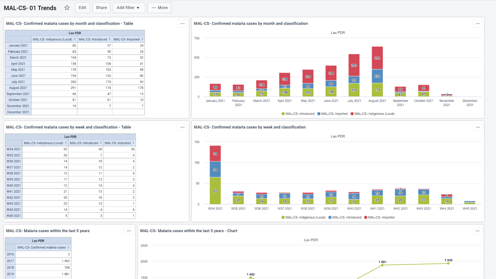

# Malaria Elimination Case Surveillance & Foci Investigation System Design

1. Introduction

Transforming the surveillance system into a core intervention is the third pillar of the [Global technical strategy for malaria 2016–2030](https://www.who.int/publications-detail-redirect/9789240031357). As countries progress towards malaria elimination, the aim of surveillance is to detect all malaria cases; investigate every confirmed malaria case; identify the likely location of an infection in order to direct actions to interrupt transmission and to ensure that each detected case is promptly treated and monitored to prevent secondary infection. An ideal surveillance information system for malaria elimination includes rapid and complete case reporting, central data storage and management, automated data analysis, and customized outputs and feedback that lead to timely and targeted responses. The DHIS2 tracker package for malaria case surveillance and foci investigation is an aid for malaria surveillance in burden reduction and elimination settings. 

The data elements included follow WHO-recommendations based on WHO global standards and normative guidance as stipulated in the organisations guidelines and guiding documents; in particular, the [Malaria Surveillance, Monitoring and Evaluation: A reference manual ](https://www.who.int/publications-detail-redirect/9789241565578). The data gathered is rendered into actionable indicators and dashboards in line with the work of the WHO surveillance assessment toolkit. The tracker packages supporting case notification, case investigation, foci investigation and classification workflows are designed to be used in conjunction with the aggregate DHIS2 packages for malaria programme monitoring in elimination and burden reduction settings to strengthen data quality, analysis and data-driven decision making.

2. System design overview

The metadata package contains two tracker programs that support case notification, case investigation, foci investigation, and classification workflows as described WHO’s [Malaria Surveillance, Monitoring and Evaluation: A reference manual Manua](https://www.who.int/publications-detail-redirect/9789241565578). 

These tracker programs are intended to be deployed together to support typical workflows for:

1. Malaria case notification, investigation and classification; 
2. Foci investigation and classification 
3. Linking case data with foci

In elimination settings, case investigation, detection and focus investigation are elimination

surveillance activities that are interconnected and are important for reliable

determination of source of infection and classification of cases and foci to inform appropriate response

While national standard operating procedures may vary, the figure below illustrates typical elimination surveillance workflows with the examples of case notification within 1 day, case investigation within 3 days and focus investigation within 7 days, based on China’s  “1–3–7” approach. In the DHIS2 package design, the **Malaria Case Notification, Investigation & Response program **supports the case notification and investigation in the left two panels of the diagram; while the Malaria Foci Investigation program supports the focus investigation shown on the right panel. 

**FIG 1: Case notification and case and focus investigation systems according to the “1-3-7” approach supported by DHIS2 package design**

_Source: [Malaria Surveillance, Monitoring and Evaluation: A reference manual Manua](https://www.who.int/publications-detail-redirect/9789241565578)_

**MAL CS - Malaria Case Notification, Investigation & Response program**

This is a longitudinal case-based surveillance program that supports a typical workflow for notifying confirmed malaria cases and following them up through case investigation  and focus investigation to determine the source of infection and classification of cases and foci in order to guide effective responses.

It allows for cases to be linked through relationships- case to cases (detected reactively) and; a case to a foci registered in the related tracker program “Foci Investigation”. The “Foci Investigation” programme provides details on the actions taken around the index case that triggered a case investigation and the appropriate response measures that were carried out within the focus.  
 
**MAL-FOCI- Malaria Foci Investigation program**

Is a registry of all foci and their classification status, as well as effective response interventions undertaken within a foci to manage them and potential for reclassification, should the need arise.

**Dashboards** 

In addition there are also seven dashboards associated with these programmes that are populated with indicators from the respective programs. The programmes are made to work in tandem and fulfil different aspects of the  burden reduction process and malaria elimination. 

## Program structure

###2.2.1 Program summary 
 
####MAL-CS: Malaria Case Notification, Investigation & Response

| Stage | Description |
|---|---|
| Enrollment | This section allows for the recording of  information about the case and its associated organisation unit.. When a patient is enrolled in the case-based programme, they are also enrolled into their reporting health facility organisation unitand assigned a unique ID and collects general questions about the patient such as full name,age , Sex, occupation and contact details. This enrollment also serves as a case notification which is necessary to trigger an investigation. |
| Diagnosis and treatment stage | This stage records all information associated with the diagnosis of the patient, case detection setting,  history of  malaria  and travel history of the patient which is necessary for a case to be preliminarily classified. This stage is conducted at the health facility level and is  typically completed within 24 hours (1 day) of detection. |
| Case investigation and classification | This stage involves  the recording of information on, household members screened and those testing positive s capturing of the household coordinated and recording of any vector control interventions undertaken. This stage is conducted at the index case household and is typically completed within 3 days of detection by the investigation team. |
| Neighbouring household investigation | This stage allows the investigators to investigate neighbouring households which are located within a predetermined radius around the index case. This stage involves the screening for malaria of all household members,  capturing the neighbouring households' coordinates and recording  of any vector control interventions that were carried out... This is a repeatable stage and is conducted at each neighbouring household visited and is typically completed  within 3 days of index case detection by the investigation team.  |
| Case outcome | In this stage once all investigations are concluded, registration of  the final case classification as well as the outcome of the patient is recorded. This stage is to be completed ideally within 3 days of detection. |
| Routine focus investigation | This stage gathers information  on the type of population in the focus and response vector control interventions carried out . The routine focus investigation is conducted typically within 7 days of every passively detected case. |

####MAL-FOCI: Malaria Foci Investigation

 | Stage | Description |
|---|---|
| Enrollment | This stage gathers basic information about the foci ranging from the date of its registration to the foci  name and is assigned with a unique ID, creating a foci profile. |
| Focus status, investigation and classification | This is a repeatable stage which captures the status of the focus, vector behaviour, insecticide resistance status and final classification where the status of the focus is recorded and the focus is classified.  |
| Foci Response | This stage is a repeatable stage that records responses and vector control interventions carried out in this focus. |

###2.2.2. Workflow

The program assumes that all people registered have  tested positive for malaria and is divided in five non-repeatable stages which follow the case through the lifetime of their enrollment.

## 2.3.Intended users

The programme is intended to be used at point of care facilities and field level for data entry purposes, and the indicators populate dashboards that are thought to be used at national, district, facility  levels. Currently, data-entry users have access to all  the stages, but depending on in-country workflows they could be divided by program stage, for example, granting only the investigation team access to the investigation stage. 

## 2.4 User Groups 

User groups have been divided  based on the program that they will be assigned to use  and the function that the user is intended to perform. A user can belong to more than one user group if their functions overlap. In addition, further compartmentalisation can be made through assigning specific user groups for the different stages. Users will also need to be assigned an organisation unit.

**MAL-CS: Malaria Case Notification, Investigation & Response**

**MAL-CS- Data Analysis:** Has access to all dashboards but cannot modify metadata or enter new data

**MAL-CS- Data Entry:** Can enter data and create new patient records

**MAL-CS- Metadata Admin:** Can modify the metadata

The  implementing country should ensure that users have data entry and search rights for their respective Organisation units. 

**MAL-FOCI: Foci Investigation & Response**

**MAL-FOCI- Data Analysis:** Has access to all dashboards but cannot modify metadata or enter new data

**MAL-FOCI- Data Entry:** Can enter data and create new patient records

**MAL-FOCI- Metadata Admin:** Can modify the metadata

# 3. Tracker Configuration

## 3.1 Program configuration

### 3.1.1 MAL-CS: Malaria Case Notification, Investigation & Response - Program configuration

The “Malaria case notification, investigation and response”  program follows a confirmed malaria case  from when they are diagnosed with malaria until a decision on focus response is made. A patient can be enrolled as a case on the programme on more than one occasion.  The case is represented by the tracked entity type “Malaria Case”.

The program displays the front page list in order to have an at a glance list of cases in the organisation unit, and it requires a minimum of two attributes to search for cases with 50 maximum of TEIs to return in search.

The program has been set as “Audited” meaning that users have access to enrollments in other org units, but that an audit trail of who has accessed which records is kept. For a more secure approach where access is more restricted, see [here]([https://docs.dhis2.org/en/develop/using-the-api/dhis-core-version-236/new-tracker.html#webapi_nti_access_level](https://docs.dhis2.org/en/develop/using-the-api/dhis-core-version-236/new-tracker.html#webapi_nti_access_level)).

### 3.1.2 MAL-FOCI: Malaria Foci Investigation- Program configuration

The  “Malaria Foci  Investigation” program registers all the foci which have been identified. A foci is defined by the WHO as “a defined and circumscribed zone situated in an area that is or has been malarious and in which the necessary epidemiological and ecological factors are present for the transmission of malaria”. In practice investigation and detection of cases in the focus are part of the broader focus investigation, while the latter may also include additional investigations to determine causes of transmission. The foci are represented by the tracked entity type “focus area”.

The program displays the front page list in order to have an at a glance list of foci in the org unit, and it requires a minimum of one attribute to search for foci with no maximum of TEIs to return in search.

Foci do not do not have sensitive personal information registered in their enrollment as they are geographical settings, they have been set with access level “open”. This should be evaluated by local data protection legislation.

It currently has no feature point to capture coordinates at enrollment level as these are captured in the investigation stage.

## 3.2 Prefixes

Throughout the metadata package, elements are prefixed with either “MAL” an object which os shared with other Malaria programmes, “MAL-CS”; an object which is for the case surveillance program, “MAL-FOCI” for objects which are part of the Malaria Foci programme, and GEN, which are generic for our standard metadata packages.

##3.3 Unique Identifiers

The programs use different unique identifiers to aid with deduplication and with locating a case/foci. These include automatically generated IDs and should be adapted to local needs.

System Case ID - An identifier which is unique for the whole system with an automatically generated pattern in the format RANDOM(XXX######).

Malaria Local Case - ID An identifier which is unique for the whole system. It is currently not automatically generated to allow for it to be based on e.g., a paper record.

Focus ID - An identifier which is unique for the whole system with an automatically generated pattern in the format RANDOM(XXX##)
For more information about the text patterns in DHIS2, see [here.](https://docs.dhis2.org/en/use/user-guides/dhis-core-version-master/additional-information/dhis2-tutorials.html#working-with-textpattern) 

## 3.4Tracked Entity type

###MAL-CS:Malaria Case Notification, Investigation & Response

The Case Surveillance program uses the tracked entity type “Case” instead of “Person” which is what is commonly used in our metadata packages. This means that each time someone becomes infected, they become a case. A case is only allowed to be enrolled once. If someone becomes re-infected with malaria, they will have to be registered as a new case, and there are fields (in the diagnosis and treatment stage) where information about their previous infection can be recorded.

This means that there could be several “case” tracked entities which represent the same individual, and have the same National ID number, and therefore, this attribute should not be unique for the instance. A new “System case ID” is generated for each case.

Depending on implementation needs, an alternative would be to use the tracked entity type “person” and allow for multiple enrollments. In such case, it would require a new case ID for every time an infection is recorded, which results in a new enrollment, and therefore it should not be an attribute in the enrollment of the person and should rather be added as a data element in a program stage.

###MAL-FOCI: Foci Investigation & Response

The Foci program uses the tracked entity type “Focus Area”, with the mandatory attributes “Focus ID” and “Focus Name”

## 3.4 Relationships

 
The package includes two bidirectional relationship types, case to foci and case to case, using the [relationships widget](https://docs.dhis2.org/en/use/user-guides/dhis-core-version-235/tracking-individual-level-data/tracker-capture.html#add_relationship_to_tracked_entity_instance).

Case to foci allows the user to connect a case with an existing or new foci. Likewise, it allows for a foci to connect with a case. The foci are registered into the separate “Foci Investigation” programme. See installation guide for more information. 

Case to case connects two malaria cases to each other, and potentially, to other cases.

The information shown in the relationship widget can be changed by adding the attributes to the tracked entity type and marking the box “show in list”.

# 4.Stages in Detail

## 4.1 MAL-CS: Malaria Case Notification, Investigation & Response

### 4.1.1 Enrollment 

In the enrollment stage, each case is registered and assigned a System case ID as well as a Malaria case ID. These can be configured to be automatically generated and unique, depending on the needs of the implementation. 

| Name | UID | Value type | Options/Logic (if applicable) | Mandatory? |
|:---:|:---:|:---:|:---:|:---:|
| Enrollment date | qDkgAbB5Jlk | DATE |  | YES |
| System Case ID | HAZ7VQ730yn | TEXT | Automatically assigned | NO |
| Malaria Local Case ID | NXazwhBRpfA | TEXT |  | NO |
| First Name | sB1IHYu2xQT | TEXT |  | NO |
| Surname | ENRjVGxVL6l | TEXT |  | NO |
| Date of birth | NI0QRzJvQ0k | DATE |  | NO |
| Date of birth is estimated | Z1rLc1rVHK8 | TRUE_ONLY |  | NO |
| Age (years) | B6TnnFMgmCk | INTEGER_ZERO_OR_POSITIVE | Calculated by program rule | NO |
|  Sex | oindugucx72 | TEXT | FEMALE MALE | NO |
| Pregnancy Status | sPDKWSQ2vKQ | TEXT | Only visible if Female of reproductive age /YES NO | NO |
| Malaria - Occupation | ZZmkcCkzzWr | TEXT | NURSE STUDENT TEACHER TRUCKDRIVER MINEWORKER SEASONALWORKER MIGRANTWORKER FARMER | NO |
| Present Home Address | CpDhdm55uhl | TEXT |  | NO |
| Address (permanent) | XN0145qZ7kH | TEXT |  | NO |
| Nationality | spkM2E9dn2J | TEXT | Complete country list ISO codes | NO |
| Mobile phone number | fctSQp5nAYl | PHONE_NUMBER |  | NO |
| Head of Household (First Name) | YCKldfKePsC | TEXT |  | NO |
| Head of Household (Last Name) | uLvB95ZxIUL | TEXT |  | NO |

### 4.1.2 Diagnosis and treatment stage

This stage is divided into three sections. It is mandatory to enter a date of diagnosis and a case detection setting. Both these elements are heavily used for indicator calculations.

| Section | Name | UID | Value type | Logic/ Options (if any) | Mandatory? |
|---|---|---|---|---|---|
| N/A | Date of diagnosis | hYyB7FUS5eR | DATE |  | YES |
| Case Detection | Detection setting | fazCI2ygYkq | TEXT | PASSIVE REACTIVE PROACTIVE | YES |

In the malaria diagnosis section, all data relevant to the diagnosis process are recorded. There are programme rules included to facilitate data entry and hiding options when not relevant. 

| Section | Name | UID | Value type | Logic/ Options (if any) | Mandatory? |
|---|---|---|---|---|---|
| Malaria diagnosis | Reason for conducting case investigation | zFiMMpGyBgr | TEXT | Only available if “Proactive is selected in detection setting. DEVELOPMENT_OF_ACTIVITIES POPULATION_MOVEMENT REFUGEE_CRISIS CLIMATIC_TRIGGERS OTHER | NO |
| Malaria diagnosis | Conducting case investigation (other) | J4fIuC5ZLsU | TEXT |  | NO |
| Malaria diagnosis | Temperature | J7hdx5FCJvG | NUMBER |  | NO |
| Malaria diagnosis | Weight | JINgGHgqzSN | INTEGER_POSITIVE |  | NO |
| Malaria diagnosis | Symptom onset date | YEpmDm1I01R | DATE | Calculated by program rule if days with symptoms are added | NO |
| Malaria diagnosis | Symptom onset date is estimated | S6uZEpdNh8o | YES_ONLY |  | NO |
| Malaria diagnosis | Number of days with symptoms | kJiPLxGq2yI | INTEGER_ZERO_OR_POSITIVE | Calculated by program rule if date is added | NO |
| Malaria diagnosis | Malaria Diagnosis confirmed by | qdjVZojEK8S | TEXT | RDT MICROSCOPY OTHER | NO |
| Malaria diagnosis | Diagnosis method (Other) | FxYWTORW4mT | TEXT | Only visible i “Other” is selected | NO |
| Malaria diagnosis | Malaria plasmodium species identified | vGxpKVMkmaW | TEXT | Only visible if a diagnosis method is selectedPF PK PM PO PV MIX OTHER | NO |
| Malaria diagnosis | Malaria positive species (other) | voV7EhjhyJ3 | TEXT |  | NO |
| Malaria diagnosis | Malaria parasite density | Wwu7UAt7bZW | INTEGER_ZERO_OR_POSITIVE | Only visible if “Microscopy” is selected | NO |
| Malaria diagnosis | presence of gametocytes | LCxi1dciA1C | BOOLEAN | Only visible if “Microscopy” is selected | NO |
| Malaria diagnosis | MAL-CS Severity of disease | SzVk2KvkSSd | TEXT | SIMPLE SEVERE | NO |
| Malaria diagnosis | Malaria Medication | nTMP8Aj1rYA | TEXT | AL ALPLUSPQ AS-SP ASPLUSAQ ASPLUSMQ ASPLUSMQPLUSPQ ASPLUSSP ASPLUSSPPLUSPQ CHLOROQUINE DHA-PPQ DHA-PPQPLUSPQ RADICAL_CURE OTHER | NO |
| Malaria diagnosis | Admission Status | MKMyvXshCdB | TEXT | ADMITTED REFERRED OPD | NO |
| Malaria diagnosis | Reason for referral | Zlro25GTcNK | TEXT | Only visible if case admission status is “Referred”FURTHER_MANAGEMENT OUTOFSTOCK | NO |

The travel details section refers to recent travel history of  the case, both within and outside the country in order to determine preliminary classification pending investigation. Basic decision support programme rules are also included.

| Section | Name | UID | Value type | Options (if any) | Mandatory? |
|---|---|---|---|---|---|
| Travel Details | Recent travel within the country | hiymQVgVG2v | TEXT | YES NO | NO |
| Travel Details | Travel within country (30 days symptoms) | qpp5fp1RVaX | TEXT | Only available if case has traveled recently YES NO | NO |
| Travel Details | Travel inside country Region/District | SI1D9IfXiI4 | TEXT | Only available if case has traveled recently | NO |
| Travel Details | Travel inside country town/village name | eYOHoeSizJk | TEXT | Only available if case has traveled recently | NO |
| Travel Details | Travel inside country last night | BRNQ61bbt28 | DATE | Only available if case has traveled recently | NO |
| Travel Details | Travel inside country First Night | Oc9Y7jvdU2g | DATE | Only available if case has traveled recently | NO |
| Travel Details | Travel outside country | OhU3RfPlQGR | TEXT | YES NO | NO |
| Travel Details | Travel outside country last month | B1zbtdPXMRk | TEXT | Only available if case has traveled recentlyYES NO | NO |
| Travel Details | Country traveled to | f9xYwUwrHq9 | TEXT | Only available if case has traveled recentlyFull country list | NO |
| Travel Details | Travel outside country Region/District | kwv9fXr7gbj | TEXT | Only available if case has traveled recently | NO |
| Travel Details | Travel outside country town/village name | JZw2d0yzmHB | TEXT | Only available if case has traveled recently | NO |
| Travel Details | Travel outside country last night | mw2Rso4RHEF | DATE | Only available if case has traveled recently | NO |
| Travel Details | Travel outside country first night | JBBAwCahDQ3 | DATE | Only available if case has traveled recently | NO |
| Travel Details | Travel history narrative | i7JwJXVEl2C | TEXT |  | NO |
| Travel Details | Preliminary case classification | bcGuRgKDZei | TEXT | LOCAL IMPORTED INTRODUCED RECRUDESCENT INDUCED | NO |
| Travel Details | Classification Narrative | pIcW9I0z5LL | TEXT |  | NO |

The  history of malaria section deals with data related to previous Malaria infections, including the previous treatment and species identified.

| Section | Name | UID | Value type | Logic/ Options (if any) | Mandatory? |
|---|---|---|---|---|---|
| History of Malaria | Blood transfusion within past 3 months | yO0ZIegEsDk | BOOLEAN |  | NO |
| History of Malaria | history | cpXwLgQTLeO | BOOLEAN |  | NO |
| History of Malaria | Date of previous diagnosis | Urz28endlF6 | DATE | Only available if there is a history of confirmed malaria | NO |
| History of Malaria | plasmodium species (previous) | xTeHON9Jisk | TEXT | Only available if there is a history of confirmed malariaPF PK PM PO PV MIX OTHER | NO |
| History of Malaria | Malaria Medication (previous) | JndDE3YbCEB | TEXT | Only available if there is a history of confirmed malariaAL ALPLUSPQ AS-SP ASPLUSAQ ASPLUSMQ ASPLUSMQPLUSPQ ASPLUSSP ASPLUSSPPLUSPQ CHLOROQUINE DHA-PPQ DHA-PPQPLUSPQ RADICAL_CURE OTHER | NO |

The final section is not visible in the data entry screen, but it is of utmost importance for indicator calculations. It is always hidden through a program rule with the expression “true” meaning it's always hidden. Both data elements are automatically populated. The notification date comes from the current date when the report is being filled and the diagnosis date comes from the “date of diagnosis” feature in the event. The latter one is there to allow for that value to be used in indicators in other stages.

| Section | Name | UID | Value type | Options (if any) | Mandatory? |
|---|---|---|---|---|---|
| Hidden section for indicator purposes (Diagnosis) | Notification date | fPbtS7glDT2 | DATE |  | NO |
| Hidden section for indicator purposes (Diagnosis) | Diagnosis date | ObiXORrILyV | DATE |  | NO |

### 4.1.3 Case investigation and classification

This is where the magic happens. The case notification, investigation and response is the stage that is recorded as close as possible to the cases. The investigation is conducted at household using a mobile device. It includes a feature point where investigators can record the coordinates of the cases at household level. These coordinates are then used to populate the geographical dashboards. 
 
The first section deals with the location of the case

| Section | Name | UID | Value type | Options (if any) | Mandatory? |
|---|---|---|---|---|---|
| Feature | Event point |  | Coordinates |  | NO |
| Feature | Date of case investigation | wYTF0YCHMWr | DATE |  | YES |
| Case household investigation | Location where case investigation is conducted | xS8sL2MMpc0 | TEXT | HEALTHFACILITY HOUSEHOLD TELEPHONIC | NO |
| Case household investigation | Village name | Th6dW4kwZji | TEXT | Only available if investigation was held in a household | NO |

The index case household investigation is the investigation of the physical location and screening of  household members where the  cases reside. Basic validation rules are triggered if numbers are not correct (for example, more household members own a net than there are household members)

| Index case household investigation and response | Name of head of household | SlqoeFUJvUV | TEXT |  | NO |
|---|---|---|---|---|---|
| Index case household investigation and response | Number of household members | lezQpdvvGjY | INTEGER_ZERO_OR_POSITIVE |  | NO |
| Index case household investigation and response | Household members tested for malaria | y57kkdyw35d | INTEGER_ZERO_OR_POSITIVE |  | NO |
| Index case household investigation and response | Household members malaria positive | qxWAgIAfZAh | INTEGER_ZERO_OR_POSITIVE |  | NO |
| Index case household investigation and response | Sleeping places | QtZBHQORAvK | INTEGER_ZERO_OR_POSITIVE |  | NO |
| Index case household investigation and response | Household members own net | uPNwmZl8Clb | INTEGER_ZERO_OR_POSITIVE |  | NO |
| Index case household investigation and response | Residents in household who slept under a net the previous night | KA6RY4BB41F | INTEGER |  | YES |
| Index case household investigation and response | Household sprayed in the past 12 months | AeVEKN0zwJJ | BOOLEAN |  | YES |
| Index case household investigation and response | Malaria Vector Control Intervention - Indoor Residual Spraying | oYbOVrpDnRo | YES_ONLY |  | NO |
| Index case household investigation and response | Malaria Vector Control Intervention - LLIN Distribution | CSYSRYrevdf | YES_ONLY |  | NO |
| Index case household investigation and response | Vector Control Intervention - Larval Source Management | wwIvEJUmxx8 | YES_ONLY |  | NO |

The final section is not visible in the data entry screen, but it is of utmost importance for indicator calculations. It is always hidden through a program rule and both data elements are automatically populated. The two different data elements are automatically filled with data from the diagnosis stage using programme rules.

| Section | Name | UID | Value type | Options (if any) | Mandatory? |
|---|---|---|---|---|---|
| Hidden section for indicator purposes (Investigation) | Detection setting | fazCI2ygYkq | TEXT | PASSIVE REACTIVE PROACTIVE | NO |
| Hidden section for indicator purposes (Investigation) | Diagnosis date | ObiXORrILyV | DATE |  | NO |

### 4.1.4 Neighbouring household investigation

This stage records the data for the investigations done at the households in a predetermined radius of the case. Basic validation rules are triggered if numbers are not correct (for example, more household members own a net than there are household members).

| Section | Name | UID | Value type | Options (if any) | Mandatory? |
|---|---|---|---|---|---|
| Nearby household investigation | Investigation date | VgsOuy9mXyZ | DATE |  | YES |
| Nearby household investigation | Name of head of household | SlqoeFUJvUV | TEXT |  | NO |
| Nearby household investigation | Number of household members | lezQpdvvGjY | INTEGER_ZERO_OR_POSITIVE |  | NO |
| Nearby household investigation | Household members tested for malaria | y57kkdyw35d | INTEGER_ZERO_OR_POSITIVE |  | NO |
| Nearby household investigation | Household members malaria positive | qxWAgIAfZAh | INTEGER_ZERO_OR_POSITIVE |  | NO |
| Nearby household investigation | Sleeping places | QtZBHQORAvK | INTEGER_ZERO_OR_POSITIVE |  | NO |
| Nearby household investigation | Household members own net | uPNwmZl8Clb | INTEGER_ZERO_OR_POSITIVE |  | NO |
| Nearby household investigation | Residents in household who slept under a net the previous night | KA6RY4BB41F | INTEGER |  | NO |
| Nearby household investigation | Household sprayed in the past 12 months | AeVEKN0zwJJ | BOOLEAN |  | NO |
| Nearby household investigation | Malaria Vector Control Intervention - LLIN Distribution | CSYSRYrevdf | yes_ONLY |  | NO |
| Nearby household investigation | Malaria Vector Control Intervention - Indoor Residual Spraying | oYbOVrpDnRo | yes_ONLY |  | NO |

### 4.1.5 Case outcome

The case outcome records  the final case classification after the case has been investigated as well as  the outcome of the illness with the following data elements:

| Case outcome | Report date | eHvTba5ijAh | DATE |  | TRUE |
|---|---|---|---|---|:---:|
| Case outcome | Malaria Final case classification | y3CG06h1Clh | TEXT | INDIGENOUS IMPORTED INTRODUCED RECRUDESCENT INDUCED | FALSE |
| Case outcome | Outcome of illness | zXNfOKXRBA9 | TEXT | CURED DIED ABSCONDED | TRUE |

It also includes a hidden section with the data element “Admission status”, which is assigned automatically from the same data element present in the “Diagnostic and Treatment” Stage.

| Section | TEA / DE / eventDate | UID | valueType | optionSet | mandatory |
|:---:|:---:|:---:|:---:|:---:|:---:|
| Hidden Section for indicator purposes (Outcome) | Admission Status | MKMyvXshCdB | TEXT | ADMITTED REFERRED OPD | NO |

### 4.1.6 Routine focus investigation and response

This stage is completed following every case outcome. It has five sections and is non repeatable.

In the locality  section the user selects if the locality was urban or rural.

| Section | Name | UID | Value type | Options (if any) | Mandatory? |
|---|---|---|---|---|---|
| feature | Date of focus investigation | KwrBvn1EJT3 | DATE |  | YES |
| Locality | Locality | r4GBctr3Xdh | TEXT | URBAN RURAL | NO |

In the Types of population section, users select the type or types of population that exist in the case’s foci. More than one can be selected

| Section | TEA / DE / eventDate | UID | valueType | optionSet | mandatory |
|:---:|:---:|:---:|:---:|:---:|:---:|
| Type(s) of populations | MAL- Migrant | BK2d3ktuJWa | YES_ONLY |  | NO |
| Type(s) of populations | MAL- Refugee | HUzRTYRFcYn | YES_ONLY |  | NO |
| Type(s) of populations | MAL- Resident | Cd5AUkJT1mE | YES_ONLY |  | NO |
| Type(s) of populations | MAL- Temporary worker | VJ7qLlRgm7e | YES_ONLY |  | NO |

The response section gathers the date of response. 

| Section | TEA / DE / eventDate | UID | valueType | optionSet | mandatory |
|:---:|:---:|:---:|:---:|:---:|:---:|
| Response | Date of response | G7f2D1vl3fD | DATE |  | NO |

## 4.2 MAL-FOCI: Foci Investigation & Response

### 4.2.1 Enrollment 

In the foci enrollment there are only four attributes in addition to the date of registration. It has a polygon attribute which has been configured from the Tracked Entity Type and which allows it to capture the perimeter of a focus. Note that this is not configured as a program feature, because there is no support for representing polygon features in the output maps.

| Name | UID | valueType | optionSet | mandatory | mandatory |
|:---:|:---:|:---:|:---:|:---:|:---:|
| Date of Foci Registration | M3xtLkYBlKI | DATE |  | YES | NO |
|Polygon|TE type attribute | Polygonal coordinates |  | NO |  |
| Malaria foci investigation Focus Name | Kv4fmHVAzwX | TEXT |  | NO |  |
| Malaria foci investigation Locality | phxAY4PQdsT | TEXT | URBAN RURAL | NO |  |
| Malaria foci investigation Focus ID | K9innmM1nuW | TEXT |  | NO |  |
| Malaria foci investigation Focus Definition | cnXnFAStrrd | TEXT | VILLAGEFOCUS DISTRICTFOCUS REGIONFOCUS | NO |  |

### 4.2.2 Focus Status investigation and classification stage

This is a repeatable stage where the details of the focus investigation are recorded. It has five sections and following the investigation the focus should be classified Subsequent stages will include previous classification and any interventions that might have been undertaken.

The first section is hidden through programme rules if there have not been any interventions or investigations previously. If there have been interventions, then the section is displayed and most of these data elements are automatically completed based on the values from their other stages. 
 
It has a point feature which allows you to record coordinates as a point on the map to mark the location of the focus. 

| Stage | Section | TEA / DE / eventDate | UID | valueType | optionSet | mandatory |
|:---:|:---:|:---:|:---:|:---:|:---:|:---:|
|  | Feature | Point |  | Coordinates |  |  |
|  | Feature | Date of foci investigation | CWaAcQYKVpq | DATE |  | YES |
|  | Focus Status | - Date of classification | Ah29MGrnVjJ | DATE |  | NO |
|  | Focus Status | - Classification | V1OnhZYfSa2 | TEXT | ACTIVE RESIDUAL_NON-ACTIVE CLEARED | NO |
|  | Focus Status | - Previous Vector Control Interventions - LLIN distribution | jhoCqSTA2QB | YES_ONLY |  | NO |
|  | Focus Status | - Previous Vector Control Intervention - INDOOR residual spraying | e6hRE1N1Fcc | YES_ONLY |  | NO |
|  | Focus Status | - Previous Vector Control Intervention - Larval Source management | dbMsAGvictz | YES_ONLY |  | NO |

The Foci investigation section is where the bulk of the work happens. 

| Section | TEA / DE / eventDate | UID | valueType | optionSet | mandatory |
|:---:|:---:|:---:|:---:|:---:|:---:|
| Foci Investigation | - Total Population in the Focus | HDRons6AfbL | INTEGER_POSITIVE |  | NO |
| Foci Investigation | - Malaria Households | VNM6zoPECqd | INTEGER_POSITIVE |  | NO |
| Foci Investigation | MAL- Resident | Cd5AUkJT1mE | YES_ONLY |  | NO |
| Foci Investigation | MAL- Migrant | BK2d3ktuJWa | YES_ONLY |  | NO |
| Foci Investigation | MAL- Temporary worker | VJ7qLlRgm7e | YES_ONLY |  | NO |
| Foci Investigation | MAL- Refugee | HUzRTYRFcYn | YES_ONLY |  | NO |
| Foci Investigation | - Type of Population - Other | QZZA5IfHAAU | YES_ONLY |  | NO |
| Foci Investigation | - Type of Population - Specify Other | ehBd9cR5bq4 | TEXT | Only shown if other is selected | NO |
| Foci Investigation | - Geographical features | SaHE38QFFwZ | TEXT | HILLY PLATUE HILLY_AND_PLATUE | NO |
| Foci Investigation | - Development activity present | Tj642rK34Qf | YES_ONLY |  | NO |
| Foci Investigation | - Development activity type | jzksn7lA2ac | TEXT | Only shown if yes is selected previously--AGRICULTURE CONSTRUCTION MINING PLANTATION OTHER | NO |
| Foci Investigation | - Development activity other specify | gd8U1R3ALDA | TEXT | Only shown if other is selected | NO |
The vector behaviour section deals with the resting and biting behaviour of the mosquitoes in the area.

| Section | TEA / DE / eventDate | UID | valueType | optionSet | mandatory |
|:---:|:---:|:---:|:---:|:---:|:---:|
| Vector Behaviour | - Biting Behaviour | PxKiOhLn7mV | TEXT | INDOORBITING OUTDOORBITING | NO |
| Vector Behaviour | - Resting Behaviour | X1DpyS5FN3T | TEXT | INDOOR OUTDOOR | NO |

The Insecticide resistance  section registers if there is insecticide resistance in the area and to which insecticide.

| Section | TEA / DE / eventDate | UID | valueType | optionSet | mandatory |
|:---:|:---:|:---:|:---:|:---:|:---:|
| Insecticide Resistance | - Malaria Proven insecticide resistance | fyjPqlHE7Dn | BOOLEAN |  | NO |
| Insecticide Resistance | - Malaria Insecticide Name | UFTvUJIMiH0 | TEXT | Only appears if YES is previously selected.BENDIOCARB01 CARBOSULFAN04 DDT4 DIELDRIN4 MALATHION5 PIRIMPHOS025 DELTAMETHRIN005 | NO |

The classification section lets the health worker register the focus status and how it is classified based on the evidence gathered. For the next investigation, this value will be available in the data elements at the beginning of the form.

| Section | TEA / DE / eventDate | UID | valueType | optionSet | mandatory |
|:---:|:---:|:---:|:---:|:---:|:---:|
| Classification | - Focus final classification | fjdU9F6EngS | TEXT | ACTIVE RESIDUAL_NON-ACTIVE CLEARED | YES |
| Classification | - Focus date of classification | bl7EMKxJIIT | DATE |  | YES |
| Classification | - Additional Information Evidence | PILB3GtIwiJ | TEXT |  | NO |

### 4.2.3 Foci Response stage 
| Section | TEA / DE / eventDate | UID | valueType | optionSet | mandatory |
|:---:|:---:|:---:|:---:|:---:|:---:|
| Foci Response | Date of foci response | uvMKOn1oWvd | DATE |  | YES |
| Foci Response | - Households included | k0rev4WSffi | INTEGER_POSITIVE |  | NO |
| Foci Response | - People included | DX4LVYeP7bw | INTEGER_POSITIVE |  | NO |

| Section | TEA / DE / eventDate | UID | valueType | optionSet | mandatory |
|:---:|:---:|:---:|:---:|:---:|:---:|
| Vector Control | MAL- Follow-up Vector Control Intervention - LLIN Distribution | JhpYDsTUfi2 | YES_ONLY |  | NO |
| Vector Control | MAL- Follow-up Vector Control Intervention - INDOOR Residual Spraying | yhX7ljWZV9q | YES_ONLY |  | NO |
| Vector Control | - Follow-up Vector Control Intervention - Larval Source Management | c2c62aRFIfr | YES_ONLY |  | NO |

# 5.Validation rules / Program rules 

## 5.1Validation rules for malaria Case Surveillance

| name | id | description | condition |
|---|---|---|---|
| Assign event date to Diagnosis date Data Element - Diagnosis and treatment | DkNSQkPFdRe | Assigns the event date from the stage feature to the to diagnosis date Data Element - Diagnosis and treatment - this is so that it can be moved to other stages. | TRUE |
| Assign value from admission status if admission has value in diagnosis stage | PDZeegogWhP | If admission status has value in diagnosis stage, add there, this allows for calculation of inpatient deaths | d2:hasValue( 'Admitted_previous' ) |
| Assign value from detection setting if detection setting has value | kGe41u6HxR4 | If Detection setting has a value in the diagnosis stage,add it here | d2:hasValue( 'DetectionSettingNewestDiagnosis' ) |
| Assign value from Species identified if species has value in diagnosis stage | LXpKv2W5fi2 | If species has value in diagnosis stage, add in investigation, this allows for calculation of inpatient deaths | d2:hasValue( 'MalariaSpecies' ) |
| Assign value of date of completion to date of notification | Co9AGieq1lZ | If there is no value in the notification date, add the date of completion | !d2:hasValue( 'notification_date' ) |
| Assign value to diagnosis date from previous event - Case Investigation | o1I4C1t0m6x | If the case investigation stage has a date of diagnosis, add it to the DE in this stage (Hidden section) | d2:hasValue(#{Diagnosis_date_previous} ) |
| Assign value to diagnosis date from previous event - Focus routine investigation | JizPUKOPn9N | Assign value to diagnosis date from previous event - Focus routine investigation (Hidden Section) | d2:hasValue(#{Diagnosis_date_previous} ) |
| Case classified as : display as indicator | nmNzVmTYZOb | Display the results of the malaria case classification in the indicator widget | d2:hasValue('CaseClassifiedAs') |
| Date of birth : assign age in years | woDbRbosGCn | Assign the age in years based on the difference between the selected date of birth and the enrollment date into the program | d2:hasValue( A{dateofbirth} ) |
| Detection setting: proactive not selected | vvxaCLtSXqI | Hide Reason for conducting foci investigation if detection setting != "Proactive (ACD)" | #{DetectionSetting}  ==  ''  \|\| #{DetectionSetting}   == 'PASSIVE'  \|\| #{DetectionSetting}  == 'REACTIVE' |
| Hide Detection setting if no value in diagnosis | gUJMdn2k9q0 | If Detection setting does not have a value in the diagnosis stage, hide it here. | d2:hasValue( 'DetectionSettingNewestDiagnosis' ) == false |
| Hide Section for indicator purposes in case Investigation and classification | nXiXXY2Syhc | Hide Section for indicator purposes in case Investigation and classification | TRUE |
| Hide section for indicator purposes in case outcome stage | bt2DABwwFbZ | we need to transfer value to a DE in this section from a different section | TRUE |
| Hide section for indicator purposes in Diagnosis stage | TgZZ29X7wDS | Hide Section for indicator purposes in case Investigation and classification | TRUE |
| IF Microscopy is selected then HIDE Mixed | a81cE9cycNk | IF Microscopy is selected then HIDE Mixed | #{DIAGNOSIS} == 'MICROSCOPY' |
| If RDT selected then HIDE p-Ovale and P. Malariae | fdKz1gGZe4w |   | #{DIAGNOSIS} == 'RDT' |
| Indoor residual spraying : not conducted | SFNzLxobTyL | Hide the number of houses sprayed if no houses are sprayed | #{IndoorResidualSpraying}!= true |
| LLIN distribution : not conducted | cQRB9WLtnRj | Hide the number of nets distributed if no nets are distributed | #{LLINdistribution} != true |
| Location of investigation != Household then hide household | tK7B2BFBdmI | Location of investigation != Household then hide household | #{MalariaLocation} != 'HOUSEHOLD' |
| Malaria history : no history of malaria | tMawDoGpOlz | Hide related fields if the case has no history of malaria | !#{malariahistory} |
| Malaria species type != Other | eyawANeGsf4 | Hide the other species type field if the malaria species type is blank or != Other | #{MalariaSpecies} == '' \|\| #{MalariaSpecies} == 'PF' \|\| #{MalariaSpecies} == 'PV' \|\| #{MalariaSpecies} == 'MIX'  \|\| #{MalariaSpecies} == 'PO' \|\| #{MalariaSpecies} == 'PM' |
| Malaria species type : display as indicator | P2WqApkndXb | Display the results of the malaria species type as identified by the malaria test in the indicator widget | d2:hasValue('MalariaSpecies') |
| Reason for conduction case investigation != Other | XPkmjVblOJU | Hide the field for other reason for conducting case investigation if other is not selected | #{ReasonCaseInvestigation} == '' \|\| #{ReasonCaseInvestigation} == 'DEVELOPMENT_OF_ACTIVITIES' \|\| #{ReasonCaseInvestigation} == 'POPULATION_MOVEMENT' \|\| #{ReasonCaseInvestigation} == 'REFUGEE_CRISIS' \|\| #{ReasonCaseInvestigation} == 'CLIMATIC_TRIGGERS'  |
| Referred : false | IkvodVu4vZ3 | Hide reason for referral if a referral was not made | #{Referred} != 'REFERRED' |
| Residents positive for malaria > Residents tested for malaria | JVzsxIkGzAK | Residents positive for malaria > Residents tested for malaria | (d2:hasValue('HHMalariaTest') && d2:hasValue('HHMalariaPositive'))  && (#{HHMalariaPositive} > #{HHMalariaTest}) |
| Residents tested for malaria > Residents in household | nMmnj4Nb2vc | Residents tested for malaria > Residents in household | (d2:hasValue('HHMalariaTest') && d2:hasValue('HHResidents'))  && (#{HHMalariaTest} > #{HHResidents}) |
| Residents who own a bed net > Residents in household | mfRXzxXthu2 | Show warning if the Residents who slept under net the previous night > Residents in household | (d2:hasValue('HHownbednet') && d2:hasValue('HHResidents')) && (#{HHownbednet} > #{HHResidents}) |
| Residents who slept under net the previous night > Residents in household | lcpfnocmJ8z | Show warning if the Residents who slept under net the previous night > Residents in household | (d2:hasValue('HHSleptUnderNet') && d2:hasValue('HHResidents')) && (#{HHSleptUnderNet} > #{HHResidents}) |
| Sex : female, Age <= 13 | hhsVY8oobaz | Hide pregnancy status and pregnancy months when the person is female and <= 13 | A{Sex} == 'FEMALE' && (d2:yearsBetween(A{dateofbirth}, V{current_date}) <= 13) |
| Sex : is not male | L7XfyMC25Av | Hide pregnancy status fields when the person is male or the field is blank | A{Sex} != 'FEMALE' |
| Symptom onset date should be less or equal to date of diagnosis | bgcHuAXU2zw | Shows waning if symptom onset date is less or equal to date of diagnosis | #{symptom_onset_date} > V{event_date} |
| Symptoms set days with symptoms from onset date | DrYcwLbT2il | Calculates the number of days with symptoms based on the date of the event and symptoms onset date | d2:hasValue('symptom_onset_date') && !d2:hasValue('days_with_symptoms') && (#{symptom_onset_date} <= V{event_date}) && #{symptom_onset_date} != '' |
| Symptoms set negative days with symptoms for onset date | WFYSQidLXEf | Assign days with symptoms as a negative value for calculating onset date | d2:hasValue('days_with_symptoms') |
| Symptoms set onset date from days with symptoms | jsVq7Xj8g9c | Calculates the onset date based on the number of days with symptoms and the date of the event | !d2:hasValue('symptom_onset_date') && d2:hasValue('days_with_symptoms') |
| Tested by : any value and Species type : null | Xc2gb715H50 | If the case is tested for confirmation, there must be a species type identified | d2:hasValue('TestedBy') && #{MalariaSpecies} == '' |
| Tested by : display as indicator | amqPvJ3L7oK | Display the malaria test that was performed in the indicator widget | d2:hasValue('TestedBy') |
| Tested by : microscopy not selected | PynNbDcsdVU | Hide related fields to Diagnosis by if Diagnosis by != microscopy | #{TestedBy} != 'MICROSCOPY' |
| Tested by : no value selected | YZgB6IybcL1 | Hide malaria test result and malaria species type of the tested by field is not filled in | #{TestedBy} == '' |
| Tested by : other not selected | mcwkeTxUN67 | Hide related fields to Diagnosis by if Diagnosis by != other | #{TestedBy} != 'OTHER' |
| Travel outside hide 1st night | reNaR4EK74H | If you marked no or null on "recent travel outside country" then hide first night | #{Travel Outside Country} == '' \|\| #{Travel Outside Country}  == 'NO' |
| Travel outside hide country name | uDti9DthV1h | If you marked no or null on "recent travel outside country" then hide travel country name | #{Travel Outside Country} == '' \|\| #{Travel Outside Country}  == 'NO' |
| Travel outside hide last month | Rreg3r1JiBh | If you marked no or null on "recent travel outside country" then hide travel within the last 30 days | #{Travel Outside Country} == '' \|\| #{Travel Outside Country}  == 'NO' |
| Travel outside hide last night | aqtkn2WKrqq | If you marked no or null on "recent travel outside country" then hide last night | #{Travel Outside Country} == '' \|\| #{Travel Outside Country}  == 'NO' |
| Travel outside hide region district | kdeJT5Otwsc | If you marked no or null on "recent travel outside country" then hide region district | #{Travel Outside Country} == '' \|\| #{Travel Outside Country}  == 'NO' |
| Travel outside hide town village | Fj82yKhmYJN | If you marked no or null on "recent travel outside country" then hide town village | #{Travel Outside Country} == '' \|\| #{Travel Outside Country}  == 'NO' |
| Travel within hide first night | WTGf4T1so2J | If you marked no or null on "recent travel within country" then hide first night | #{Recent Travel Within Country} == '' \|\| #{Recent Travel Within Country}  == 'NO' |
| Travel within hide last month | tqFHykJ37zJ | If you marked no or null on "recent travel within country" then hide travel within the last 30 days | #{Recent Travel Within Country} == '' \|\| #{Recent Travel Within Country}  == 'NO' |
| Travel within hide Last night | JcgCZeirV6n | If you marked no or null on "recent travel within country" then hide last night | #{Recent Travel Within Country} == '' \|\| #{Recent Travel Within Country}  == 'NO' |
| Travel within hide Region/District | zsgZLubWrms | If you marked no or null on "recent travel within country" then hide Region/District | #{Recent Travel Within Country} == '' \|\| #{Recent Travel Within Country}  == 'NO' |
| Travel within hide Town/village | p0kqW6hTYde | If you marked no or null on "recent travel within country" then hide town/Village | #{Recent Travel Within Country} == '' \|\| #{Recent Travel Within Country}  == 'NO' |

## 5.2 Validation rules for Malaria Foci Investigation and response

| name | id | description | condition |
|---|---|---|---|
| Assign value date of previous focus classification | nkd671Zt84p | It shows the last date the focus was classified | d2:hasValue( 'date_of_classification_previous' ) == true |
| Development activity: null | dCKxEP5bGvh | Hide the development activity selection if there is no development activity present | !#{DevelopmentActivity} |
| Display a Check next to previous Indoor residual spraying if it was previously selected as an action | ITYLhBRfOZA | Display a Check next to previous Indoor residual spraying if was previously selected as an action | d2:hasValue( 'Indoor residual Spraying PREVIOUS' ) |
| Display a Check next to previous Larval Source Management if it was previously selected as an action | WhQGnsfxs7j | Display a Check next to previous Larval Source Management if was previously selected as an action | d2:hasValue( 'Larval Source Management PREVIOUS' ) |
| Display a Check next to previousLLIN if LLIN was previously selected as an action | HuhD0jX9ARr | Display a Check next to previous LLIN if LLIN was previously selected as an action | d2:hasValue( 'LLIN PREVIOUS' ) |
| Display vector classification | Ogo0Ciuybz3 | If a vector was classified previously, this will show that classification | d2:hasValue( 'Previous Focus Classification' ) |
| Foci classification : display as indicator | TxkEg880fsw | Display the results of the foci classification in the indicator widget | d2:hasValue('FociClassification') |
| Hide "Development activity other specify" | QqQxy5JKBt2 | Unless "Development activity= Other", hide "Development activity other specify" | #{Development activity Other} == '' \|\| #{Development activity Other} == 'AGRICULTURE' \|\| #{Development activity Other} == 'CONSTRUCTION' \|\| #{Development activity Other} == 'MINING' \|\| #{Development activity Other} == 'PLANTATION' |
| Hide "Population type specify other" | IAWNVLOF8Rd | If population type "other" is not selected, hide "Population type specify other" | !d2:hasValue(‘PopulationTypeOther’) \|\| !#{PopulationTypeOther} |
| Hide focus status section if no previous status | mIDKsALzkMc | If there was not a focus status previously registered, then the section called “Focus status” does not appear. Typically when it’s the first investigation conducted. | d2:hasValue( 'date_of_classification_previous' ) == false \|\| d2:hasValue( 'date_of_classification_previous' ) == false |
| Hide insecticide list if not proven resistant to insecticides | eEgli5CXC9g | If it | #{insecticide_resistance_proven} != true |
| If zero houses visited, hide Vector control section | khygXEKXJSe |  | #{households_visited} == 0 |

# 6. Analytics

## 6.1 Dashboards

The package includes seven dashboards, 6 of them are based exclusively on indicators from MAL-CS, the remaining one has a combination of Indicators from MAL-CS and MAL-FOCI. A number  has been added to their name to keep them in a logical order and they are prefixed with the respective programme.

### MAL-CS- 01 Trends

 
### MAL-CS-02 Epidemiology

 

### MAL-CS-03 Treatment and Diagnostic

 

### MAL-CS-04 Case Notification & Investigation

 

### MAL-CS-05- Case Classification

### MAL-CS-06- Geolocation

 

#### Foci polygons

The Foci Investigation and Response programme allows for polygons to be captured instead of points. Currently and due to limitations in the packaging process, these are not included as maps analytics objects in the programmes by default, but they can be easily added as a tracked entity layer 

### MAL-FOCI

 

## Indicators and Program Indicators

The indicators on this package have been built based on specifications from guiding documents from the WHO. Due to limitations on calculating indicators based on data from multiple events, some programme rules have been used to move data into “hidden sections'' throughout the program. When modifying the package, extra care should be taken that the data elements in these hidden sections are being populated correctly. This can be tested directly in Tracker by removing the program rules which hide the sections. The rules for this are all called “_Hide Section for indicator purposes”. In DHIS2, we differentiate between “Program indicators”, which are based on counting events or enrollments based on a filter, and “Indicators” which are constructed with a numerator and denominator. In most cases for this program, we are using program indicators to create the indicators. 

### 6.1 Program Indicators:

| pi_name | pi_shortname | pi_desc | pi_filter |
|---|---|---|---|
| Age 0-5 | Age 0-5 |  | d2:yearsBetween(A{NI0QRzJvQ0k} , V{enrollment_date})>=0 && d2:yearsBetween(A{NI0QRzJvQ0k} , V{enrollment_date})<6 |
| Age 16-26 | Age 16-26 |  | d2:yearsBetween(A{NI0QRzJvQ0k} , V{enrollment_date})>=16 && d2:yearsBetween(A{NI0QRzJvQ0k} , V{enrollment_date})<27 |
| Age 27-37 | Age 27-37 |  | d2:yearsBetween(A{NI0QRzJvQ0k} , V{enrollment_date})>=27 && d2:yearsBetween(A{NI0QRzJvQ0k} , V{enrollment_date})<38 |
| Age 38-49 | Age 38-49 |  | d2:yearsBetween(A{NI0QRzJvQ0k} , V{enrollment_date})>=38 && d2:yearsBetween(A{NI0QRzJvQ0k} , V{enrollment_date})<50 |
| Age 50-60 | Age 50-60 |  | d2:yearsBetween(A{NI0QRzJvQ0k} , V{enrollment_date})>=50 && d2:yearsBetween(A{NI0QRzJvQ0k} , V{enrollment_date})<61 |
| Age 6-16 | Age 6-16 |  | d2:yearsBetween(A{NI0QRzJvQ0k} , V{enrollment_date})>=6 && d2:yearsBetween(A{NI0QRzJvQ0k} , V{enrollment_date})<16 |
| Age 61-71 | Age 61-71 |  | d2:yearsBetween(A{NI0QRzJvQ0k} , V{enrollment_date})>=61 && d2:yearsBetween(A{NI0QRzJvQ0k} , V{enrollment_date})<72 |
| Age 72-82 | Age 72-82 |  | d2:yearsBetween(A{NI0QRzJvQ0k} , V{enrollment_date})>=72 && d2:yearsBetween(A{NI0QRzJvQ0k} , V{enrollment_date})<83 |
| Age 83-93 | Age 83-93 |  | d2:yearsBetween(A{NI0QRzJvQ0k} , V{enrollment_date})>=83 && d2:yearsBetween(A{NI0QRzJvQ0k} , V{enrollment_date})<94 |
| Age 94-104 | Age 94-104 |  | d2:yearsBetween(A{NI0QRzJvQ0k} , V{enrollment_date})>=94 && d2:yearsBetween(A{NI0QRzJvQ0k} , V{enrollment_date})<104 |
| MAL-CS- Active case detection | Active Case detection | Detection by health workers of malaria cases at community and household levels, sometimes in population groups that are considered at high risk. Active case detection can consist of screening for fever followed by parasitological examination of all febrile patients or as parasitological examination of the target population without prior screening for fever. | #{hYyB7FUS5eR.fazCI2ygYkq} == 'PROACTIVE' \|\| #{hYyB7FUS5eR.fazCI2ygYkq} == 'REACTIVE' |
| MAL-CS- Case investigated | Malaria Case investigated |  | d2:hasValue(#{wYTF0YCHMWr.fazCI2ygYkq}) |
| MAL-CS- Cases classified | Malaria Cases classified | Number of cases classified as either indigenous, introduced, imported or induced | (#{eHvTba5ijAh.y3CG06h1Clh}=='IMPORTED'\|\| #{eHvTba5ijAh.y3CG06h1Clh}=='INTRODUCED'\|\|#{eHvTba5ijAh.y3CG06h1Clh}=='INDUCED'\|\|#{eHvTba5ijAh.y3CG06h1Clh} == 'INDIGENOUS'\|\|#{eHvTba5ijAh.y3CG06h1Clh} == 'RECRUDESCENT') && V{program_stage_id}=='eHvTba5ijAh' |
| MAL-CS- Cases detected through PCD | Cases detected through PCD | Number of cases detected through Passive case detection | #{hYyB7FUS5eR.fazCI2ygYkq} == 'PASSIVE' |
| MAL-CS- Cases diagnosed last 24 hours | Cases last 24 hours | Number of cases diagnosed in the previous 24 hours | d2:daysBetween(V{event_date},V{analytics_period_end}) == 0 && d2:hasValue(#{hYyB7FUS5eR.fazCI2ygYkq}) |
| MAL-CS- Cases due to mixed infection | Malaria cases mixed | A malaria infection caused by more than one species of plasmodium detected by RDT, microscopy or a molecular test | #{hYyB7FUS5eR.vGxpKVMkmaW} == 'MIX' |
| MAL-CS- Cases tested by microscopy | Case tested by microscopy | The number of suspected malaria cases tested by Microscopy | #{hYyB7FUS5eR.qdjVZojEK8S} == 'MICROSCOPY' && V{program_stage_id} == 'hYyB7FUS5eR' |
| MAL-CS Confirmed cases investigated in N2 days (3 days) | Cases reported within 3 days | Number of confirmed (PCD) malaria cases investigated within (N2),the number of days after confirmation, defined in the national guideline | ((V{program_stage_id} == 'hYyB7FUS5eR' && d2:daysBetween(V{enrollment_date},V{event_date}) <4) && d2:hasValue(#{hYyB7FUS5eR.fazCI2ygYkq}) ) && #{hYyB7FUS5eR.fazCI2ygYkq} == 'PASSIVE' |
| MAL-CS- Confirmed cases with symptoms tested with either microscopy or RDT within 24 hours of patient presentation to the health facility | Cases tested with microscopy or RDT in 24h | N: Number of confirmed cases with symptoms tested with either microscopy or RDT within 24 hours of patient presentation to the health facility | V{program_stage_id} == 'hYyB7FUS5eR' && d2:daysBetween(V{event_date},#{hYyB7FUS5eR.fPbtS7glDT2}) <2 && (#{hYyB7FUS5eR.qdjVZojEK8S} == 'RDT' \|\| #{hYyB7FUS5eR.qdjVZojEK8S} == 'MICROSCOPY') |
| MAL-CS- Confirmed malaria cases | Confirmed malaria cases | A case due to mosquito-borne transmission and is acquired outside the area in which it was detected, in a known malarious area to or from which the patient has travelled outside the elimination area | d2:hasValue(#{hYyB7FUS5eR.qdjVZojEK8S}) && V{program_stage_id}=='hYyB7FUS5eR' |
| MAL CS- Confirmed malaria cases investigated within N2 days | Confirmed malaria cases investigated in N2 days | Number of confirmed malaria cases investigated within (N2),the number of days after confirmation, defined in the national guideline (3 days) | d2:daysBetween(V{event_date},#{wYTF0YCHMWr.ObiXORrILyV}) < 4 |
| MAL-CS- Confirmed with a known species | Confirmed with known species |  | d2:hasValue(#{hYyB7FUS5eR.vGxpKVMkmaW}) |
| MAL-CS- Female | Female | Female cases | A{oindugucx72} == 'FEMALE' |
| MAL-CS- Foci investigated within N3 days of diagnosis | Foci investigated within N3 days of diagnosis |  | d2:daysBetween(#{KwrBvn1EJT3.ObiXORrILyV},V{event_date}) <= 3 |
| MAL-CS- Foci with response within N7 days of diagnosis | Foci with response within N7 days of diagnosis | N: Number of case notifications received within N1 (24h) of diagnosis | (V{program_stage_id} == 'KwrBvn1EJT3' && d2:hasValue(#{KwrBvn1EJT3.ObiXORrILyV}) && d2:hasValue(#{KwrBvn1EJT3.G7f2D1vl3fD}) && d2:daysBetween(#{KwrBvn1EJT3.ObiXORrILyV},#{KwrBvn1EJT3.G7f2D1vl3fD}) <= 7) |
| MAL-CS- Imported | Imported malaria cases | Confirmed malaria cases classified as imported. A case due to mosquito-borne transmission and is acquired outside the area in which it was detected, in a known malarious area to or from which the patient has travelled outside the elimination area | #{wYTF0YCHMWr.bcGuRgKDZei} == 'IMPORTED' |
| MAL-CS- Indigenous (Local) | Indigenous malaria cases | Confirmed malaria cases classified as indigenous - A case contracted locally with no evidence of importation and no direct link to transmission from an imported case | #{eHvTba5ijAh.y3CG06h1Clh}== 'INDIGENOUS' \|\| #{eHvTba5ijAh.y3CG06h1Clh} == 'INTRODUCED' |
| MAL-CS- Induced | Induced | Cases not due to mosquito-borne transmission e.g blood transfusion or congenital malaria | #{wYTF0YCHMWr.bcGuRgKDZei} == 'INDUCED' |
| MAL-CS- inpatient | MAL-CS- inpatient case |  | #{hYyB7FUS5eR.MKMyvXshCdB}== 'ADMITTED' |
| MAL-CS- inpatient deaths | inpatient deaths |  | #{eHvTba5ijAh.MKMyvXshCdB} == 'ADMITTED' && #{eHvTba5ijAh.zXNfOKXRBA9} == 'DIED' |
| MAL-CS- Introduced | Introduced | Confirmed malaria cases classified as introduced. A case contracted locally, with strong epidemiological evidence linking it directly to a known imported case (first-generation local transmission). First-generation local transmission; epidemiologically linked to proven imported case | #{wYTF0YCHMWr.bcGuRgKDZei} == 'INTRODUCED' |
| MAL-CS- Malaria age current (months) | Malaria age current (months) |  | d2:yearsBetween(A{NI0QRzJvQ0k},V{current_date})<1 |
| MAL-CS Malaria age current (years) | Malaria age current (years) |  | d2:yearsBetween(A{NI0QRzJvQ0k},V{current_date}) > 0 |
| MAL-CS- Malaria cases (All registered) | All Malaria Cases |  | TRUE |
| MAL-CS- Malaria death | Malaria death |  | #{eHvTba5ijAh.zXNfOKXRBA9} == 'DIED' && V{program_stage_id} == 'eHvTba5ijAh' |
| MAL-CS- Malaria test - RDT | Malaria test - RDT | The number of suspected malaria cases tested by RDT | #{hYyB7FUS5eR.qdjVZojEK8S} == 'RDT' |
| MAL-CS- Male | Male |  | A{oindugucx72} == 'MALE' |
| MAL-CS- microscopy 0-4 years female | microscopy (f 0-4) | The number of suspected malaria cases tested by Microscopy with a positive result | d2:yearsBetween(A{NI0QRzJvQ0k}, V{enrollment_date}) >= 0 and d2:yearsBetween(A{NI0QRzJvQ0k}, V{enrollment_date}) < 5 and A{oindugucx72} == 'FEMALE' and #{hYyB7FUS5eR.qdjVZojEK8S} == 'MICROSCOPY' |
| MAL-CS- microscopy 0-4 years male | microscopy (m 0-4) | The number of suspected malaria cases tested by Microscopy with a positive result | d2:yearsBetween(A{NI0QRzJvQ0k}, V{enrollment_date}) >= 0 and d2:yearsBetween(A{NI0QRzJvQ0k}, V{enrollment_date}) < 5 and A{oindugucx72} == 'MALE' and #{hYyB7FUS5eR.qdjVZojEK8S} == 'MICROSCOPY' |
| MAL-CS- microscopy 15+ years female | microscopy (f 15+) | The number of suspected malaria cases tested by Microscopy with a positive result | d2:yearsBetween(A{NI0QRzJvQ0k}, V{enrollment_date}) >= 15 and A{oindugucx72} == 'FEMALE' and #{hYyB7FUS5eR.qdjVZojEK8S} == 'MICROSCOPY' |
| MAL-CS- microscopy 15+ years male | microscopy (m 15+) | The number of suspected malaria cases tested by Microscopy with a positive result | d2:yearsBetween(A{NI0QRzJvQ0k}, V{enrollment_date}) >= 15 and A{oindugucx72} == 'MALE' and #{hYyB7FUS5eR.qdjVZojEK8S} == 'MICROSCOPY' |
| MAL-CS- microscopy 5-14 years female | microscopy (f 5-14) | The number of suspected malaria cases tested by Microscopy with a positive result | d2:yearsBetween(A{NI0QRzJvQ0k}, V{enrollment_date}) >= 5 and d2:yearsBetween(A{NI0QRzJvQ0k}, V{enrollment_date}) < 15 and A{oindugucx72} == 'FEMALE' and #{hYyB7FUS5eR.qdjVZojEK8S} == 'MICROSCOPY' |
| MAL-CS- microscopy 5-14 years male | microscopy (m 5-14) | The number of suspected malaria cases tested by Microscopy with a positive result | d2:yearsBetween(A{NI0QRzJvQ0k}, V{enrollment_date}) >= 5 and d2:yearsBetween(A{NI0QRzJvQ0k}, V{enrollment_date}) < 15 and A{oindugucx72} == 'MALE' and #{hYyB7FUS5eR.qdjVZojEK8S} == 'MICROSCOPY' |
| MAL-CS- microscopy (other) | mic (other) |  | #{hYyB7FUS5eR.qdjVZojEK8S} == 'MICROSCOPY' and #{hYyB7FUS5eR.vGxpKVMkmaW} == 'OTHER' |
| MAL-CS- microscopy Pf. | microscopy Pf. |  | #{hYyB7FUS5eR.qdjVZojEK8S} == 'MICROSCOPY' and #{hYyB7FUS5eR.vGxpKVMkmaW} == 'PF' |
| MAL-CS- microscopy Pf. 0-4 years female | microscopy (Pf., f 0-4) |  | d2:yearsBetween(A{NI0QRzJvQ0k}, V{enrollment_date}) >= 0 and d2:yearsBetween(A{NI0QRzJvQ0k}, V{enrollment_date}) < 5 and A{oindugucx72} == 'FEMALE'and #{hYyB7FUS5eR.qdjVZojEK8S} == 'MICROSCOPY' and #{hYyB7FUS5eR.vGxpKVMkmaW} == 'PF' |
| MAL-CS- microscopy Pf. 0-4 years male | microscopy (Pf., m 0-4) |  | d2:yearsBetween(A{NI0QRzJvQ0k}, V{enrollment_date}) >= 0 and d2:yearsBetween(A{NI0QRzJvQ0k}, V{enrollment_date}) < 5 and A{oindugucx72} == 'MALE'and #{hYyB7FUS5eR.qdjVZojEK8S} == 'MICROSCOPY' and #{hYyB7FUS5eR.vGxpKVMkmaW} == 'PF' |
| MAL-CS- microscopy Pf. 15+ years female | microscopy (Pf., f 15+) |  | d2:yearsBetween(A{NI0QRzJvQ0k}, V{enrollment_date}) >= 15 and A{oindugucx72} == 'FEMALE'and #{hYyB7FUS5eR.qdjVZojEK8S} == 'MICROSCOPY' and #{hYyB7FUS5eR.vGxpKVMkmaW} == 'PF' |
| MAL-CS- microscopy Pf. 15+ years male | microscopy (Pf., m 15+) |  | d2:yearsBetween(A{NI0QRzJvQ0k}, V{enrollment_date}) >= 15 and A{oindugucx72} == 'MALE'and #{hYyB7FUS5eR.qdjVZojEK8S} == 'MICROSCOPY' and #{hYyB7FUS5eR.vGxpKVMkmaW} == 'PF' |
| MAL-CS- microscopy Pf. 5-14 years female | microscopy (Pf., f 5-14) |  | d2:yearsBetween(A{NI0QRzJvQ0k}, V{enrollment_date}) >= 5 and d2:yearsBetween(A{NI0QRzJvQ0k}, V{enrollment_date}) < 15 and A{oindugucx72} == 'FEMALE'and #{hYyB7FUS5eR.qdjVZojEK8S} == 'MICROSCOPY' and #{hYyB7FUS5eR.vGxpKVMkmaW} == 'PF' |
| MAL-CS- microscopy Pf. 5-14 years male | microscopy (Pf., m 5-14) |  | d2:yearsBetween(A{NI0QRzJvQ0k}, V{enrollment_date}) >= 5 and d2:yearsBetween(A{NI0QRzJvQ0k}, V{enrollment_date}) < 15 and A{oindugucx72} == 'MALE'and #{hYyB7FUS5eR.qdjVZojEK8S} == 'MICROSCOPY' and #{hYyB7FUS5eR.vGxpKVMkmaW} == 'PF' |
| MAL-CS- Mixed | Mixed |  | #{hYyB7FUS5eR.vGxpKVMkmaW} == 'MIX' |
| MAL-CS- Mixed RDT | Mixed RDT |  | #{hYyB7FUS5eR.vGxpKVMkmaW} == 'MIX' && #{hYyB7FUS5eR.qdjVZojEK8S} == 'RDT' |
| MAL-CS- Nationality: BY COUNTRY | NATIONALITY: BY COUNTRY | One PI per country based on attribute "Nationality" | A{spkM2E9dn2J} == 'AF' |
| MAL-CS- Newly diagnosed | Newly diagnosed | Number of newly diagnosed malaria cases during a defined period in a specified population | d2:daysBetween(V{enrollment_date}, V{analytics_period_start}) > 0 && d2:daysBetween(V{enrollment_date}, V{analytics_period_end}) < 0 |
| MAL-CS- Notification received within N1 (24 hs) of diagnosis | Cases notified within 24hs | N: Number of case notifications received within N1 (24h) of diagnosis | (V{program_stage_id} == 'hYyB7FUS5eR' && d2:daysBetween(V{event_date},#{hYyB7FUS5eR.fPbtS7glDT2}) < 2 && d2:hasValue(#{hYyB7FUS5eR.fazCI2ygYkq}) && d2:hasValue(#{hYyB7FUS5eR.qdjVZojEK8S}) ) |
| MAL-CS- Not pregnant | Not pregnant | Not pregnant female cases | A{oindugucx72} == 'FEMALE' && (A{sPDKWSQ2vKQ}== 'NO' \|\| A{sPDKWSQ2vKQ}== '') |
| MAL-CS- Number of confirmed Malaria Cases investigated (PCD) | Confirmed cases investigated (PCD) | Number of positive cases detected through PCD and investigated | #{wYTF0YCHMWr.fazCI2ygYkq} == 'PASSIVE' |
| MAL-CS- Occupation Farmer | Occupation Farmer | Occupation Farmer | A{ZZmkcCkzzWr} == 'FARMER' |
| MAL-CS- Occupation Migrant worker | Occupation Migrant worker | Occupation Migrant worker | A{ZZmkcCkzzWr} == 'MIGRANTWORKER' |
| MAL-CS- Occupation Mine Worker | Occupation Mine Worker | Occupation Mine worker | A{ZZmkcCkzzWr} == 'MINEWORKER' |
| MAL-CS- Occupation Nurse | Occupation Nurse | Occupation Nurse | A{ZZmkcCkzzWr} == 'NURSE' |
| MAL-CS- Occupation Seasonal worker | Occupation Seasonal worker | Occupation Seasonal worker | A{ZZmkcCkzzWr} == 'SEASONALWORKER' |
| MAL-CS- Occupation Student | Occupation Student | Occupation Student | A{ZZmkcCkzzWr} == 'STUDENT' |
| MAL-CS- Occupation Teacher | Occupation Teacher | Occupation Teacher | A{ZZmkcCkzzWr} == 'TEACHER' |
| MAL-CS- Occupation Truck driver | Occupation Truck driver | Occupation Truck driver | A{ZZmkcCkzzWr} == 'TRUCKDRIVER' |
| MAL-CS- Other Species (Cases due to) | MAL-CS- Other Species |  | #{hYyB7FUS5eR.vGxpKVMkmaW} == 'OTHER' |
| MAL-CS- outpatient | outpatient |  | #{hYyB7FUS5eR.MKMyvXshCdB} == 'ADMITTED' |
| MAL-CS- Passive case detection | Passive Case detection | Detection by health workers of malaria cases at community and household levels, sometimes in population groups that are considered at high risk. Active case detection can consist of screening for fever followed by parasitological examination of all febrile patients or as parasitological examination of the target population without prior screening for fever. | #{hYyB7FUS5eR.fazCI2ygYkq} == 'PASSIVE' |
| MAL-CS- Pf. 0-4 years female RDT & Microscopy | Pf., f 0-4 |  | d2:yearsBetween(A{NI0QRzJvQ0k}, V{enrollment_date}) >= 0 and d2:yearsBetween(A{NI0QRzJvQ0k}, V{enrollment_date}) < 5 and A{oindugucx72} == 'FEMALE' && #{hYyB7FUS5eR.vGxpKVMkmaW} == 'PF' && #{hYyB7FUS5eR.qdjVZojEK8S} == 'RDT' && #{hYyB7FUS5eR.qdjVZojEK8S} == 'MICROSCOPY' |
| MAL-CS- Pf. 0-4 years male RDT & Microscopy | (Pf., m 0-4) |  | d2:yearsBetween(A{NI0QRzJvQ0k}, V{enrollment_date}) >= 0 and d2:yearsBetween(A{NI0QRzJvQ0k}, V{enrollment_date}) < 5 and A{oindugucx72} == 'MALE' && #{hYyB7FUS5eR.vGxpKVMkmaW} == 'PF' && #{hYyB7FUS5eR.qdjVZojEK8S} == 'RDT' && #{hYyB7FUS5eR.qdjVZojEK8S} == 'MICROSCOPY' |
| MAL-CS- Pf. 15+ years female RDT & Microscopy | (Pf., f 15+) |  | d2:yearsBetween(A{NI0QRzJvQ0k}, V{enrollment_date}) >= 15 and A{oindugucx72} == 'FEMALE' && #{hYyB7FUS5eR.vGxpKVMkmaW} == 'PF' && #{hYyB7FUS5eR.qdjVZojEK8S} == 'RDT' && #{hYyB7FUS5eR.qdjVZojEK8S} == 'MICROSCOPY' |
| MAL-CS- Pf. 15+ years male RDT & Microscopy | Pf., m 15+ |  | d2:yearsBetween(A{NI0QRzJvQ0k}, V{enrollment_date}) >= 15 and A{oindugucx72} == 'MALE' && #{hYyB7FUS5eR.vGxpKVMkmaW} == 'PF' && #{hYyB7FUS5eR.qdjVZojEK8S} == 'RDT' && #{hYyB7FUS5eR.qdjVZojEK8S} == 'MICROSCOPY' |
| MAL-CS- Pf. 5-14 years female RDT & Microscopy | Pf., f 5-14 |  | d2:yearsBetween(A{NI0QRzJvQ0k}, V{enrollment_date}) >= 5 and d2:yearsBetween(A{NI0QRzJvQ0k}, V{enrollment_date}) < 15 and A{oindugucx72} == 'FEMALE' && #{hYyB7FUS5eR.vGxpKVMkmaW} == 'PF' && #{hYyB7FUS5eR.qdjVZojEK8S} == 'RDT' && #{hYyB7FUS5eR.qdjVZojEK8S} == 'MICROSCOPY' |
| MAL-CS- Pf. 5-14 years male RDT & Microscopy | Pf., m 5-14 |  | d2:yearsBetween(A{NI0QRzJvQ0k}, V{enrollment_date}) >= 5 and d2:yearsBetween(A{NI0QRzJvQ0k}, V{enrollment_date}) < 15 and A{oindugucx72} == 'MALE' && #{hYyB7FUS5eR.vGxpKVMkmaW} == 'PF' && #{hYyB7FUS5eR.qdjVZojEK8S} == 'RDT' && #{hYyB7FUS5eR.qdjVZojEK8S} == 'MICROSCOPY' |
| MAL-CS- P.Falciparum (cases due to) RDT or Microscopy | Pf. RDT or Microscopy | Malaria cases caused by the species P. falciparum, detected either by RDT, microscopy or a molecular test | #{hYyB7FUS5eR.vGxpKVMkmaW} == 'PF' && (#{hYyB7FUS5eR.qdjVZojEK8S} == 'RDT' \|\| #{hYyB7FUS5eR.qdjVZojEK8S} == 'MICROSCOPY') |
| MAL-CS- P.Knowlesi (Cases due to) Microscopy | P.knowlesi case | A malaria case caused by the species P. knowlesi detected by microscopy | #{hYyB7FUS5eR.vGxpKVMkmaW} == 'PK' |
| MAL-CS- P Malariae. 0-4 years female Microscopy | P Malariae., f 0-4 |  | d2:yearsBetween(A{NI0QRzJvQ0k}, V{enrollment_date}) >= 0 and d2:yearsBetween(A{NI0QRzJvQ0k}, V{enrollment_date}) < 5 and A{oindugucx72} == 'FEMALE' && #{hYyB7FUS5eR.vGxpKVMkmaW} == 'PM' && #{hYyB7FUS5eR.qdjVZojEK8S} == 'MICROSCOPY' |
| MAL-CS- P Malariae. 0-4 years male Microscopy | P Malariae., m 0-4 |  | d2:yearsBetween(A{NI0QRzJvQ0k}, V{enrollment_date}) >= 0 and d2:yearsBetween(A{NI0QRzJvQ0k}, V{enrollment_date}) < 5 and A{oindugucx72} == 'MALE' && #{hYyB7FUS5eR.vGxpKVMkmaW} == 'PM' && #{hYyB7FUS5eR.qdjVZojEK8S} == 'MICROSCOPY' |
| MAL-CS- P Malariae. 15+ years female Microscopy | P Malariae., f 15+ |  | d2:yearsBetween(A{NI0QRzJvQ0k}, V{enrollment_date}) >= 15 and A{oindugucx72} == 'FEMALE' && #{hYyB7FUS5eR.vGxpKVMkmaW} == 'PM' && #{hYyB7FUS5eR.qdjVZojEK8S} == 'MICROSCOPY' |
| MAL-CS- P Malariae. 15+ years male Microscopy | P Malariae., m 15+ |  | d2:yearsBetween(A{NI0QRzJvQ0k}, V{enrollment_date}) >= 15 and A{oindugucx72} == 'MALE' && #{hYyB7FUS5eR.vGxpKVMkmaW} == 'PM' && #{hYyB7FUS5eR.qdjVZojEK8S} == 'MICROSCOPY' |
| MAL-CS- P Malariae. 5-14 years female Microscopy | P Malariae, f 5-14 |  | d2:yearsBetween(A{NI0QRzJvQ0k}, V{enrollment_date}) >= 5 and d2:yearsBetween(A{NI0QRzJvQ0k}, V{enrollment_date}) < 15 and A{oindugucx72} == 'FEMALE' && #{hYyB7FUS5eR.vGxpKVMkmaW} == 'PM' && #{hYyB7FUS5eR.qdjVZojEK8S} == 'MICROSCOPY' |
| MAL-CS- P Malariae. 5-14 years male Microscopy | P Malariae, m 5-14 |  | d2:yearsBetween(A{NI0QRzJvQ0k}, V{enrollment_date}) >= 5 and d2:yearsBetween(A{NI0QRzJvQ0k}, V{enrollment_date}) < 15 and A{oindugucx72} == 'MALE' && #{hYyB7FUS5eR.vGxpKVMkmaW} == 'PM' && #{hYyB7FUS5eR.qdjVZojEK8S} == 'MICROSCOPY' |
| MAL-CS- P.Malariae (cases due to) | P.Malariae case | Malaria cases caused by the species P. malariae | #{hYyB7FUS5eR.vGxpKVMkmaW} == 'PM' |
| MAL-CS- P.Malariae (cases due to) Microscopy | P.M Microscopy |  | #{hYyB7FUS5eR.vGxpKVMkmaW} == 'PM' && #{hYyB7FUS5eR.qdjVZojEK8S} == 'MICROSCOPY' |
| MAL-CS- P O. 0-4 years female Microscopy | P O., f 0-4 |  | d2:yearsBetween(A{NI0QRzJvQ0k}, V{enrollment_date}) >= 0 and d2:yearsBetween(A{NI0QRzJvQ0k}, V{enrollment_date}) < 5 and A{oindugucx72} == 'FEMALE' && #{hYyB7FUS5eR.vGxpKVMkmaW} == 'PO' && #{hYyB7FUS5eR.qdjVZojEK8S} == 'MICROSCOPY' |
| MAL-CS- P O. 0-4 years male Microscopy | P O., m 0-4 |  | d2:yearsBetween(A{NI0QRzJvQ0k}, V{enrollment_date}) >= 0 and d2:yearsBetween(A{NI0QRzJvQ0k}, V{enrollment_date}) < 5 and A{oindugucx72} == 'MALE' && #{hYyB7FUS5eR.vGxpKVMkmaW} == 'PO' && #{hYyB7FUS5eR.qdjVZojEK8S} == 'MICROSCOPY' |
| MAL-CS- P O. 15+ years female Microscopy | P O., f 15+ |  | d2:yearsBetween(A{NI0QRzJvQ0k}, V{enrollment_date}) >= 15 and A{oindugucx72} == 'FEMALE' && #{hYyB7FUS5eR.vGxpKVMkmaW} == 'PO' && #{hYyB7FUS5eR.qdjVZojEK8S} == 'MICROSCOPY' |
| MAL-CS- P O. 15+ years male Microscopy | P O., m 15+ |  | d2:yearsBetween(A{NI0QRzJvQ0k}, V{enrollment_date}) >= 15 and A{oindugucx72} == 'MALE' && #{hYyB7FUS5eR.vGxpKVMkmaW} == 'PO' && #{hYyB7FUS5eR.qdjVZojEK8S} == 'MICROSCOPY' |
| MAL-CS- P O. 5-14 years female Microscopy | (P O, f 5-14) |  | d2:yearsBetween(A{NI0QRzJvQ0k}, V{enrollment_date}) >= 5 and d2:yearsBetween(A{NI0QRzJvQ0k}, V{enrollment_date}) < 15 and A{oindugucx72} == 'FEMALE' && #{hYyB7FUS5eR.vGxpKVMkmaW} == 'PO' && #{hYyB7FUS5eR.qdjVZojEK8S} == 'MICROSCOPY' |
| MAL-CS- P O. 5-14 years male Microscopy | P O, m 5-14 |  | d2:yearsBetween(A{NI0QRzJvQ0k}, V{enrollment_date}) >= 5 and d2:yearsBetween(A{NI0QRzJvQ0k}, V{enrollment_date}) < 15 and A{oindugucx72} == 'MALE' && #{hYyB7FUS5eR.vGxpKVMkmaW} == 'PO' && #{hYyB7FUS5eR.qdjVZojEK8S} == 'MICROSCOPY' |
| MAL-CS- P.Ovale | P.Ovale |  | #{hYyB7FUS5eR.vGxpKVMkmaW} == 'PO' |
| MAL-CS- P.Ovale (Cases due to) Microscopy | P O. Microscopy |  | #{hYyB7FUS5eR.vGxpKVMkmaW} == 'PO' && #{hYyB7FUS5eR.qdjVZojEK8S} == 'MICROSCOPY' |
| MAL-CS- Pregnant | Pregnant | Female cases | A{sPDKWSQ2vKQ} == 'YES' |
| MAL-CS- Proactive case detection | Proactive case detection |  | #{hYyB7FUS5eR.fazCI2ygYkq} == 'PROACTIVE' |
| MAL-CS- Pv. 0-4 years female RDT & Microscopy | microscopy (Pv., f 0-4) |  | d2:yearsBetween(A{NI0QRzJvQ0k}, V{enrollment_date}) >= 0 and d2:yearsBetween(A{NI0QRzJvQ0k}, V{enrollment_date}) < 5 and A{oindugucx72} == 'FEMALE' and #{hYyB7FUS5eR.qdjVZojEK8S} == 'MICROSCOPY'&& #{hYyB7FUS5eR.vGxpKVMkmaW} == 'PV'&& #{hYyB7FUS5eR.qdjVZojEK8S} == 'RDT' |
| MAL-CS- Pv. 0-4 years male RDT & Microscopy | microscopy (Pv., m 0-4) |  | d2:yearsBetween(A{NI0QRzJvQ0k}, V{enrollment_date}) >= 0 and d2:yearsBetween(A{NI0QRzJvQ0k}, V{enrollment_date}) < 5 and A{oindugucx72} == 'MALE' and #{hYyB7FUS5eR.qdjVZojEK8S} == 'MICROSCOPY' && #{hYyB7FUS5eR.vGxpKVMkmaW} == 'PV' && #{hYyB7FUS5eR.qdjVZojEK8S} == 'RDT' |
| MAL-CS- Pv. 15+ years female RDT & Microscopy | Pv., f 15+ RDT & Microscopy |  | d2:yearsBetween(A{NI0QRzJvQ0k}, V{enrollment_date}) >= 15 and A{oindugucx72} == 'FEMALE' and #{hYyB7FUS5eR.qdjVZojEK8S} == 'MICROSCOPY' && #{hYyB7FUS5eR.vGxpKVMkmaW} == 'PV' && #{hYyB7FUS5eR.qdjVZojEK8S} == 'RDT' |
| MAL-CS- Pv. 15+ years male RDT & Microscopy | Pv., m 15+ RDT & Microscopy |  | d2:yearsBetween(A{NI0QRzJvQ0k}, V{enrollment_date}) >= 15 and A{oindugucx72} == 'MALE' and #{hYyB7FUS5eR.qdjVZojEK8S} == 'MICROSCOPY' && #{hYyB7FUS5eR.vGxpKVMkmaW} == 'PV' && #{hYyB7FUS5eR.qdjVZojEK8S} == 'RDT' |
| MAL-CS- Pv. 5-14 years female RDT & Microscopy | Pv., f 5-14 RDT & Microscopy |  | d2:yearsBetween(A{NI0QRzJvQ0k}, V{enrollment_date}) >= 5 and d2:yearsBetween(A{NI0QRzJvQ0k}, V{enrollment_date}) < 15 and A{oindugucx72} == 'FEMALE' and #{hYyB7FUS5eR.qdjVZojEK8S} == 'MICROSCOPY' && #{hYyB7FUS5eR.vGxpKVMkmaW} == 'PV' && #{hYyB7FUS5eR.qdjVZojEK8S} == 'RDT' |
| MAL-CS- Pv. 5-14 years male RDT & Microscopy | (Pv., m 5-14) RDT & Microscopy |  | d2:yearsBetween(A{NI0QRzJvQ0k}, V{enrollment_date}) >= 5 and d2:yearsBetween(A{NI0QRzJvQ0k}, V{enrollment_date}) < 15 and A{oindugucx72} == 'MALE' and #{hYyB7FUS5eR.qdjVZojEK8S} == 'MICROSCOPY' && #{hYyB7FUS5eR.vGxpKVMkmaW} == 'PV' && #{hYyB7FUS5eR.qdjVZojEK8S} == 'RDT' |
| MAL-CS- P.vivax | Pv |  | #{hYyB7FUS5eR.vGxpKVMkmaW} == 'PV' |
| MAL-CS- P.vivax (cases due to) RDT & microscopy | Pv RDT & microscopy |  | #{hYyB7FUS5eR.vGxpKVMkmaW} == 'PV' && ( #{hYyB7FUS5eR.qdjVZojEK8S} == 'MICROSCOPY' \|\| #{hYyB7FUS5eR.qdjVZojEK8S} == 'RDT') |
| MAL-CS- RDT | MAL-CS- RDT case | The number of malaria cases tested by RDT with a positive result | #{hYyB7FUS5eR.qdjVZojEK8S} == 'RDT' |
| MAL-CS- RDT 0-4 years female | RDT (f 0-4) | The number of suspected malaria cases tested by RDT with a positive result | d2:yearsBetween(A{NI0QRzJvQ0k}, V{enrollment_date}) >= 0 and d2:yearsBetween(A{NI0QRzJvQ0k}, V{enrollment_date}) < 5 and A{oindugucx72} == 'FEMALE' and #{hYyB7FUS5eR.qdjVZojEK8S} == 'RDT' |
| MAL-CS- RDT 0-4 years male | RDT (m 0-4) | The number of suspected malaria cases tested by RDT with a positive result | d2:yearsBetween(A{NI0QRzJvQ0k}, V{enrollment_date}) >= 0 and d2:yearsBetween(A{NI0QRzJvQ0k}, V{enrollment_date}) < 5 and A{oindugucx72} == 'MALE' and #{hYyB7FUS5eR.qdjVZojEK8S} == 'RDT' |
| MAL-CS- RDT 15+ years female | RDT (f 15+) | The number of suspected malaria cases tested by RDT with a positive result | d2:yearsBetween(A{NI0QRzJvQ0k}, V{enrollment_date}) >= 15 and A{oindugucx72} == 'FEMALE' and #{hYyB7FUS5eR.qdjVZojEK8S} == 'RDT' |
| MAL-CS- RDT 15+ years male | RDT (m 15+) | The number of suspected malaria cases tested by RDT with a positive result | d2:yearsBetween(A{NI0QRzJvQ0k}, V{enrollment_date}) >= 15 and A{oindugucx72} == 'MALE' and #{hYyB7FUS5eR.qdjVZojEK8S} == 'RDT' |
| MAL-CS- RDT 5-14 years female | RDT (f 5-14) | The number of suspected malaria cases tested by RDT with a positive result | d2:yearsBetween(A{NI0QRzJvQ0k}, V{enrollment_date}) >= 5 and d2:yearsBetween(A{NI0QRzJvQ0k}, V{enrollment_date}) < 15 and A{oindugucx72} == 'FEMALE' and #{hYyB7FUS5eR.qdjVZojEK8S} == 'RDT' |
| MAL-CS- RDT 5-14 years male | RDT m 5-14 | The number of suspected malaria cases tested by RDT with a positive result | d2:yearsBetween(A{NI0QRzJvQ0k}, V{enrollment_date}) >= 5 and d2:yearsBetween(A{NI0QRzJvQ0k}, V{enrollment_date}) < 15 and A{oindugucx72} == 'MALE' and #{hYyB7FUS5eR.qdjVZojEK8S} == 'RDT' |
| MAL-CS- RDT+Microscopy | RDT+Microscopy | Total malaria positives cases by Microscopy and RDT | (#{hYyB7FUS5eR.qdjVZojEK8S} == 'RDT' or #{hYyB7FUS5eR.qdjVZojEK8S} == 'MICROSCOPY') |
| MAL-CS- RDT+Microscopy 0-4 years female | RDT+Microscopy (f 0-4) | Total malaria positives cases by Microscopy and RDT | d2:yearsBetween(A{NI0QRzJvQ0k}, V{enrollment_date}) >= 0 and d2:yearsBetween(A{NI0QRzJvQ0k}, V{enrollment_date}) < 5 and A{oindugucx72} == 'FEMALE' and (#{hYyB7FUS5eR.qdjVZojEK8S} == 'RDT' or #{hYyB7FUS5eR.qdjVZojEK8S} == 'MICROSCOPY') |
| MAL-CS- RDT+Microscopy 0-4 years male | RDT+Microscopy (m 0-4) | Total malaria positives cases by Microscopy and RDT | d2:yearsBetween(A{NI0QRzJvQ0k}, V{enrollment_date}) >= 0 and d2:yearsBetween(A{NI0QRzJvQ0k}, V{enrollment_date}) < 5 and A{oindugucx72} == 'MALE' and (#{hYyB7FUS5eR.qdjVZojEK8S} == 'RDT' or #{hYyB7FUS5eR.qdjVZojEK8S} == 'MICROSCOPY') |
| MAL-CS- RDT+Microscopy 15+ years female | RDT+Microscopy (f 15+) | Total malaria positives cases by Microscopy and RDT | d2:yearsBetween(A{NI0QRzJvQ0k}, V{enrollment_date}) >= 15 and A{oindugucx72} == 'FEMALE' and (#{hYyB7FUS5eR.qdjVZojEK8S} == 'RDT' or #{hYyB7FUS5eR.qdjVZojEK8S} == 'MICROSCOPY') |
| MAL-CS- RDT+Microscopy 15+ years male | RDT+Microscopy (m 15+) | Total malaria positives cases by Microscopy and RDT | d2:yearsBetween(A{NI0QRzJvQ0k}, V{enrollment_date}) >= 15 and A{oindugucx72} == 'MALE' and (#{hYyB7FUS5eR.qdjVZojEK8S} == 'RDT' or #{hYyB7FUS5eR.qdjVZojEK8S} == 'MICROSCOPY') |
| MAL-CS- RDT+Microscopy 5-14 years female | RDT+Microscopy (f 5-14) | Total malaria positives cases by Microscopy and RDT | d2:yearsBetween(A{NI0QRzJvQ0k}, V{enrollment_date}) >= 5 and d2:yearsBetween(A{NI0QRzJvQ0k}, V{enrollment_date}) < 15 and A{oindugucx72} == 'FEMALE' and (#{hYyB7FUS5eR.qdjVZojEK8S} == 'RDT' or #{hYyB7FUS5eR.qdjVZojEK8S} == 'MICROSCOPY') |
| MAL-CS- RDT+Microscopy 5-14 years male | RDT+Microscopy (m 5-14) | Total malaria positives cases by Microscopy and RDT | d2:yearsBetween(A{NI0QRzJvQ0k}, V{enrollment_date}) >= 5 and d2:yearsBetween(A{NI0QRzJvQ0k}, V{enrollment_date}) < 15 and A{oindugucx72} == 'MALE' and (#{hYyB7FUS5eR.qdjVZojEK8S} == 'RDT' or #{hYyB7FUS5eR.qdjVZojEK8S} == 'MICROSCOPY') |
| MAL-CS- RDT (other) | RDT (other) |  | #{hYyB7FUS5eR.qdjVZojEK8S} == 'RDT' and #{hYyB7FUS5eR.vGxpKVMkmaW} == 'OTHER' |
| MAL-CS- Reactive case detection | Reactive Case detection |  | #{hYyB7FUS5eR.fazCI2ygYkq} == 'REACTIVE' |
| MAL-FOCI- Foci Classified | Foci classified |  | (#{CWaAcQYKVpq.fjdU9F6EngS} == 'ACTIVE' \|\| #{CWaAcQYKVpq.fjdU9F6EngS} == 'RESIDUAL_NON-ACTIVE'\|\| #{CWaAcQYKVpq.fjdU9F6EngS} == 'CLEARED') |
| MAL-FOCI- Foci classified as active | Foci active |  | (#{CWaAcQYKVpq.fjdU9F6EngS} == 'ACTIVE' && V{program_stage_id} == 'CWaAcQYKVpq') |
| MAL-FOCI- Foci classified as residual non-active | Foci residual non-active |  | (#{CWaAcQYKVpq.fjdU9F6EngS} == 'RESIDUAL_NON-ACTIVE' && V{program_stage_id} == 'CWaAcQYKVpq') |
| MAL-FOCI- Foci Identified | Foci Identified | Total number of foci in the registry in a one year period | TRUE |
| MAL-FOCI- Foci investigated | Foci investigations |  | (d2:hasValue(#{CWaAcQYKVpq.fjdU9F6EngS}) && V{program_stage_id} =='CWaAcQYKVpq') |
| MAL-FOCI- Foci Reclassified | Foci Reclassified | Number of foci reclassified in a year | d2:hasValue(#{CWaAcQYKVpq.fjdU9F6EngS}) && d2:hasValue(#{CWaAcQYKVpq.V1OnhZYfSa2}) && V{program_stage_id} == 'CWaAcQYKVpq' |
| MAL-FOCI- Foci Registered | Foci Registered | Total number of foci in the registry | TRUE |
| MAL-FOCI- Foci with response | Foci with response | Number of malaria foci that received any form of response | V{program_stage_id} =='uvMKOn1oWvd' |

## 6.2 Indicators

| Indicator name | Numerator description | Denominator description |
|---|---|---|
| MAL-CS- Case reports received < 24 h after detection % | Number of case notifications received within 24h of diagnosis | Total number of confirmed malaria case reports  |
| MAL-CS- Cases diagnosed with Microscopy (%) | Malaria cases diagnosed by Microscopy | Total confirmed malaria cases  |
| MAL-CS- Cases diagnosed with RDT (%) | Malaria cases diagnosed by RDT | Total confirmed Malaria cases  |
| MAL-CS- Cases investigated (%) | Number of cases investigated | Number of positive cases detected through PCD  |
| MAL-CS- Cases investigated on time (%) | sum of cases with enrollment date within 3 days from date of diagnosis | Total confirmed cases reported |
| MAL-CS- Cases notified on time (%) | sum of cases enrollment date within 1 day from date of diagnosis | Total confirmed cases reported |
| MAL-CS- Cases notified within N1 days (24 hs) (%) | Number of cases within the time limit specified by national guidelines for time from diagnosis to notification (typically within 24 hrs) | Total number of confirmed malaria cases reported through PCD |
| MAL-CS- Confirmed cases classified (%) | Number of positive cases classified | Number of positive cases detected through PCD and investigated x100 |
| MAL-CS- Confirmed cases investigated (%) | Number of positive cases detected through PCD and investigated | Number of positive cases detected through PCD  |
| MAL-CS- Confirmed cases with symptoms diagnosed within 24 hours (%) | N: Number of confirmed  cases with symptoms tested with either microscopy or RDT within 24 hours of patient presentation to the health facility | Total number of confirmed malaria cases reported through PCD |
| MAL-CS- Female cases (%) | Malaria female cases | Total confirmed Malaria cases  |
| MAL-CS- Foci investigated within N3 days of diagnosis (%) | Confirmed Malaria Cases | Foci investigated within N3 days of diagnosis |
| MAL-CS- Foci with response within N7 days of diagnosis (%) | N7 | Confirmed Malaria Cases |
| MAL-CS- Imported cases (%) | Number of Imported cases | Confirmed Malaria Cases |
| MAL-CS- Indigenous cases (%) | Number of indigenous cases | Confirmed Malaria Cases |
| MAL-CS- Introduced cases (%) | Number of Introduced cases | Confirmed Malaria Cases |
| MAL-CS- Malaria Case Occupation: Farmer (%) | Farmer | Total cases |
| MAL-CS- Malaria Case Occupation: Migrant Worker (%) | Migrant worker | Total cases  |
| MAL-CS- Malaria Case Occupation: Mine worker (%) | Mine workers | Total cases  |
| MAL-CS- Malaria Case Occupation: Nurse (%) | Malaria Nurse | Total cases |
| MAL-CS- Malaria Case Occupation: Seasonal worker (%) | Seasonal worker | Total cases |
| MAL-CS- Malaria Case Occupation: Student (%) | Malaria Student | Total cases |
| MAL-CS- Malaria Case Occupation: Teacher (%) | Malaria Teacher | Total cases |
| MAL-CS- Malaria Case Occupation: Truck Driver (%) | Malaria Student | Total cases |
| MAL-CS- Male cases (%) | Malaria male cases | Total confirmed Malaria cases  |
| MAL-CS- Mixed infection cases (%) | Malaria cases due to P.vivax identified by RDT or microscopy | Total confirmed Malaria cases with a known species |
| MAL-CS- P.falciparum cases (%) | Malaria cases due to P.Falciparum | Total confirmed Malaria cases with a known species |
| MAL-CS- P.vivax cases (%) | Malaria cases due to mixed infection | Total confirmed Malaria cases with a known species |
| MAL-CS- Passive case detection (%) | Passive | Total confirmed Malaria cases with a known species |
| MAL-CS- Proactive case detection (%) | Proactive | Total confirmed Malaria cases with a known species |
| MAL-CS- Proportion of imported cases | Imported cases | Total confirmed malaria cases |
| MAL-CS- Proportion of local cases | Local cases (indigenous + introduced) | Total confirmed malaria cases |
| MAL-CS- Reactive case detection (%) | Reactive | Total confirmed Malaria cases with a known species |
| MAL-CS- Timeliness - Case notifications received within (N1) 24h of detection % | Number of case notifications received within 24h of diagnosis | Number of cases reported |
| MAL-CS- Timeliness - Cases investigated within (N2) diagnosis (3 days) % | Number of case notifications received within 24h of diagnosis | Number of cases reported |
| MAL-FOCI- Foci classified (%) | Number of foci classified | Total number of foci in the registry |
| MAL-FOCI- Foci classified as active (%) | Number of foci classified as active | Total number of foci in the registry |
| MAL-FOCI- Foci classified as cleared (%) | Number of foci classified as cleared | Total number of foci in the registry |
| MAL-FOCI- Foci classified as residual non-active (%) | Number of foci classified as residual non-active | Total number of foci in the registry |
| MAL-FOCI- Foci investigated (%) | Number of foci investigated | Total Number of foci recorded in this period |

Note:  
Indicators that calculate a percentage of cases based on detection vs. outcome can show a result exceeding 100%, this results from cases in which the outcome happens in the following period. In particular for confirmed cases classified, the percentage can be more than 100% since the confirmation comes from diagnosis and treatment and the classification from the outcome, in a report the outcome could be in a different period. 

## Android compatibility

The program as it stands is fully compatible with Android. When implementing with Android, especially if the program is modified, it is important to be familiar with the Android implementation guide [https://docs.dhis2.org/en/full/implement/dhis2-android-implementation-guide.html](https://docs.dhis2.org/en/full/implement/dhis2-android-implementation-guide.html) 

